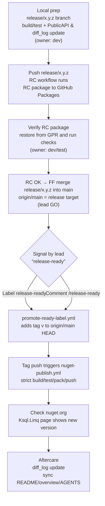

# Release Flow: Local → GitHub Packages (RC) → nuget.org (Stable)

Local prep → publish RC to GitHub Packages → verify RC → lead signals “release-ready” → auto-tag and publish to nuget.org.

## Flow (mermaid)

Lead’s explicit actions: review RC result → decide GO → add label `release-ready` or comment `/release-ready` on the tracking Issue/PR.

## Preconditions
- Base branch: `main`
- Release work branch: `release/<version>` (e.g., `release/0.9.4`)
- `<Version>` in `src/Ksql.Linq.csproj` is the release number (RC/preview suffix is added by workflow)
- Tests exclude Integration (align with CI)

## 0. Local prep (mandatory)
1) Branch: `git switch -c release/<version>`
2) Align version/notes: update `<Version>` and `PackageReleaseNotes` in `src/Ksql.Linq.csproj`; append `docs/diff_log/diff_<feature>_<YYYYMMDD>.md`. Also update `examples/Directory.Build.props` to reference the new `Ksql.Linq` package version so examples build against the released API.
3) Public API check: `dotnet build src/Ksql.Linq.csproj -c Release -p:StrictPublicApi=true -warnaserror:RS0016,RS0017`
4) Tests (no Integration): `dotnet test tests/Ksql.Linq.Tests.csproj -c Release --filter "TestCategory!=Integration"`
5) Commit & push: `git push origin release/<version>`

## 1. RC publish (GitHub Packages)
- Trigger: push to `release/**` (workflow `publish-preview.yml`)
- Behavior: packs with `<Version>-<suffix>` and pushes to GitHub Packages
- Verify:
  - Actions job `Publish preview package to GitHub Packages` is green
  - Use a NuGet.config pointing to GitHub Packages and restore/install the RC package to validate
  - When RC is OK, Fast-forward merge `release/<version>` into `main`; `origin/main` HEAD is now the release commit (lead GO decision)

## 2. Release signal and full automation (no manual tagging)
- Lead signal (choose one):
  - Add label `release-ready` to the tracking Issue/PR (OWNER/MEMBER/COLLABORATOR)
  - Comment `/release-ready` on the tracking Issue/PR (same roles)
- Automation:
  - `.github/workflows/promote-ready-label.yml` or `.github/workflows/promote-ready-comment.yml` reads `<Version>` from `src/Ksql.Linq.csproj` and tags `origin/main` HEAD with `v<Version>`
  - Tag push triggers `.github/workflows/nuget-publish.yml` (build/test/pack/push)
  - Assumption: `release/<version>` has already been merged into `main`; tag always points to `origin/main` HEAD

## 3. Stable publish to nuget.org (post-check only)
- Trigger: `v*.*.*` tag → `.github/workflows/nuget-publish.yml`
- Steps: Public API strict build → tests (no Integration) → pack → push to nuget.org (`ON_MASTER` check)
- Verify:
  - `Publish Stable to nuget.org` is green in Actions
  - nuget.org `Ksql.Linq` page shows the new version
- CLI publish: if needed, tag `cli-v*.*.*` separately or add similar automation

## 4. Aftercare
- Update and commit diff_log with what shipped and CI outcomes
- Sync README / overview.md / AGENTS.md if needed

## Intent
- Validate via GitHub Packages RC before cutting the stable tag
- Lead-only signal (label or comment) drives auto-tagging and nuget publish
- CI handles stable publish on tag; local focus stays on prep and GO decision
